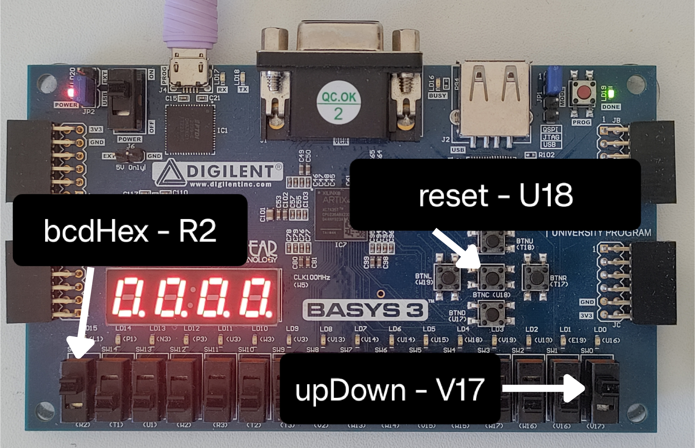

# Seven-Segment Up/Down Counter

SystemVerilog FPGA project for the Digilent Basys 3 board. The design drives the four-digit seven-segment display using multiplexing and supports both BCD and hexadecimal up/down counting.

## Demo

### Board Control Mapping



### BCD Counter Demo

[Watch BCD counter demo](media/BCD_Counter.mp4)

The BCD demo shows:

- Up-counting
- Down-counting
- Forward wraparound from `9999` to `0000`
- Reverse wraparound from `0000` to `9999`

### HEX Counter Demo

[Watch HEX counter demo](media/HEX_Counter.mp4)

The HEX demo shows:

- Up-counting
- Down-counting
- Forward wraparound from `ffff` to `0000`
- Reverse wraparound from `0000` to `ffff`

## Hardware

Target board:

- Digilent Basys 3 FPGA board
- 100 MHz system clock
- Four-digit common-anode seven-segment display

The Basys 3 seven-segment display uses active-low control signals:

```text
0 = ON
1 = OFF
```

This applies to both the anode digit enables and the cathode segment outputs.

## Top-Level Module

Top-level RTL file:

```text
rtl/sevenSegDisplay.sv
```

Top-level module:

```systemverilog
display_7seg
```

The top-level module has three 1-bit user inputs and two display outputs.

| Signal | Direction | Width | Description |
|---|---:|---:|---|
| `clk` | Input | 1-bit | 100 MHz system clock |
| `reset` | Input | 1-bit | Resets the counters and display refresh logic |
| `upDown` | Input | 1-bit | Selects count direction |
| `bcdHex` | Input | 1-bit | Selects BCD or HEX counting mode |
| `an` | Output | 4-bit | Active-low digit enable output |
| `seg` | Output | 8-bit | Active-low segment output, including decimal point |

## Board Controls

| Function | RTL Signal | Basys 3 Pin / Control | Description |
|---|---|---|---|
| Mode select | `bcdHex` | `R2` | Selects BCD or HEX counter bank |
| Direction select | `upDown` | `V17` | Selects up-counting or down-counting |
| Reset | `reset` | `U18` | Resets the design |
| Display anodes | `an[3:0]` | `W4 V4 U4 U2` | Selects the active display digit |
| Display cathodes | `seg[7:0]` | `V7 U7 V5 U5 V8 U8 W6 W7` | Drives the seven-segment LEDs and decimal point |

## Display Output Mapping

The seven-segment output is connected through `seg[7:0]`.

```text
seg[6:0] = seven-segment LED pattern
seg[7]   = decimal point
```

In this implementation, `seg[7]` is assigned to `0`.

Since the Basys 3 seven-segment display is active-low, this means the decimal point LED is always on for the active digit.

The segment bit order used by the decoder is:

```systemverilog
seg[6:0] = {g, f, e, d, c, b, a}
```

## Features

- Four-digit seven-segment display driver
- BCD counting mode
- HEX counting mode
- Up-counting
- Down-counting
- Forward wraparound
- Reverse wraparound
- Runtime BCD/HEX mode selection
- Separate BCD and HEX counter banks
- State retention when switching between BCD and HEX modes
- Active-low Basys 3 anode/cathode control
- Display multiplexing
- Parameterized count tick period
- Parameterized display refresh bit selection for simulation and hardware

## Design Overview

The design has two main timing paths from the system clock.

```text
clk
├── oneHertz tick generator
│   └── enables the selected counter bank
│
└── LED refresh counter
    └── multiplexes the four seven-segment digits
```

The counting logic and display refresh logic are independent.

The tick generator controls when the numeric value changes. The display refresh counter continuously scans the four digits fast enough that the physical display appears steady.

## Counting Modes

The design contains separate counter banks for BCD and HEX mode.

When `bcdHex = 1`:

```text
BCD counters are enabled and displayed.
HEX counters are paused.
```

When `bcdHex = 0`:

```text
HEX counters are enabled and displayed.
BCD counters are paused.
```

The inactive counter bank is not reset. It retains its previous value. This allows switching between BCD and HEX modes while preserving each mode's state.

## BCD Behavior

In BCD mode, each digit counts from `0` to `9`.

Forward counting:

```text
0000 -> 0001 -> 0002 -> ... -> 9999 -> 0000
```

Reverse counting:

```text
0000 -> 9999 -> 9998 -> ... -> 0001 -> 0000
```

## HEX Behavior

In HEX mode, each digit counts from `0` to `f`.

Forward counting:

```text
0000 -> 0001 -> 0002 -> ... -> ffff -> 0000
```

Reverse counting:

```text
0000 -> ffff -> fffe -> ... -> 0001 -> 0000
```

## Seven-Segment Decoder

The decoder maps a 4-bit value to an active-low seven-segment pattern.

The displayed hexadecimal characters are:

```text
0 1 2 3 4 5 6 7 8 9 a b c d e f
```

## Folder Structure

```text
01-seven-segment-counter/
├── constraints/
│   └── Basys-3-Master.xdc
├── media/
│   ├── FPGA_PINS.png
│   ├── BCD_Counter.mp4
│   └── HEX_Counter.mp4
├── rtl/
│   ├── bcdCounter.sv
│   ├── hexCounter.sv
│   ├── oneHertz.sv
│   ├── sevenSegDecoder.sv
│   └── sevenSegDisplay.sv
├── testbench/
│   └── tb_seven_seg.sv
└── README.md
```

## RTL Modules

| File | Purpose |
|---|---|
| `sevenSegDisplay.sv` | Top-level module that connects the counters, tick generator, display refresh logic, anode control, and cathode decoder |
| `sevenSegDecoder.sv` | Converts a 4-bit value into a seven-segment LED pattern |
| `bcdCounter.sv` | Single-digit BCD up/down counter |
| `hexCounter.sv` | Single-digit hexadecimal up/down counter |
| `oneHertz.sv` | Generates the slower counter-enable tick from the 100 MHz clock |

## Simulation

The testbench uses smaller timing parameters so the design can be simulated quickly.

In simulation:

- `TICK_PERIOD = 16` makes the counter update every 16 clock cycles.
- `REFRESH_BIT_HI = 3` and `REFRESH_BIT_LO = 2` make each digit stay active for 4 clock cycles.
- One full four-digit display scan takes 16 clock cycles.

These timing choices are independent, but they line up neatly in the testbench for easier waveform/debug inspection.

## What I Learned

This project reinforced:

- SystemVerilog module design
- Clocked counter logic
- BCD counting
- Hexadecimal counting
- Up/down control
- Forward and reverse wraparound
- Carry and borrow propagation across digits
- Seven-segment display decoding
- Active-low FPGA I/O behavior
- Display multiplexing
- Runtime mode selection
- Simulation with shortened timing parameters
- Debugging bit-order mismatches between RTL and board constraints

## Status

Implemented in SystemVerilog, simulated with a testbench, and tested on the Basys 3 FPGA board.

