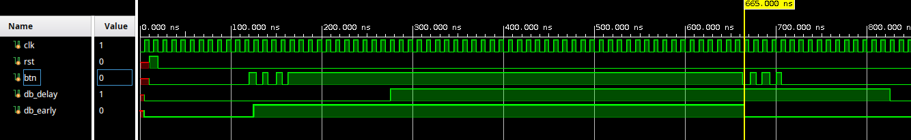

# Debounce Circuits
Basys 3 (Artix-7 XC7A35T) · SystemVerilog · Vivado/XSIM

## Status - Delayed Debounce
- RTL: done
- Verification: done
- Hardware Validation: not yet

## Status - Early Debounce
- RTL: done
- Verification: done
- Hardware Validation: not yet

## Spec - Delayed Debounce
- Input: single-bit button signal, `btn`
- Output: single-bit debounced signal, synchronous to `SYS_CLK`
- Polling interval: `btn` sampled every `TICK_TIME` ns (default 10 ms)
- Debounce window: 2-3x polling interval (20 to 30 ms), confirmed stable on both press and release transitions
- Reset: synchronous, active-high

## Spec - Early Debounce
- Input and Output same as Delayed Debounce
- Polling interval: `TICK_TIME` ns (default 10 ms), same free-running tick source
- Output asserts on the first sampled edge of `btn`, before the transition is confirmed
- Masking window: 2-3x polling interval (20 to 30 ms) following each assertion, during which `btn` is ignored
- Input resampled at the end of the masking window: transition is kept if `btn` still agrees, discarded if not
- Pulse width tracks the physical button duration; edge-to-edge latency is ~1 clock on both transitions
- Glitch response: an unresolved glitch produces a bounded pulse on `db` lasting one masking window, cleared at resample
- Reset: synchronous, active-high

## Interfaces
```systemverilog
module delay_debounce #(
    parameter TICK_TIME = 10_000_000, // (in ns)
    parameter SYS_CLK = 10 // (in ns)
)(
    input clk,
    input rst,
    input btn, 
    output db
);

module early_debounce #(
    parameter TICK_TIME = 10_000_000, // (in ns)
    parameter SYS_CLK = 10 // (ns)
)(
    input logic clk,
    input logic rst,
    input logic btn,
    output logic db
);
```
## Simulation

`testbench/tb_debounce.sv` drives both modules from the same stimulus: a bounce
burst settling high, a sustained press, a bounce burst settling low. `TICK_TIME`
is set to 50 ns for simulation speed.



Both outputs reject the bounce bursts. `db_early` follows the button edges within
a clock; `db_delay` lags each edge by 2-3 ticks.
